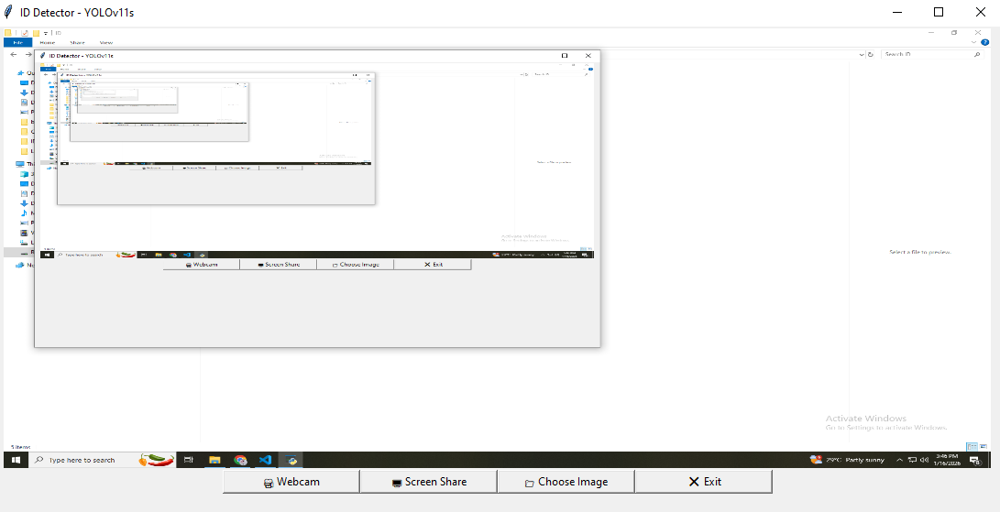

# 🏫Colegio-De-montalban-ID-lace-tracker🏫
This project is a real-time machine learning application that detects whether students are wearing their ID laces at Colegio de Montalban. 
It uses YOLOv11 for object detection and OpenCV for video processing, supporting multiple input sources:

- Webcam: Live classroom monitoring
- Screen Share: Detect ID laces only from desktop/video streams
- Image Upload: Analyze static photos

The system provides visual feedback, highlighting detected ID laces and allowing schools to monitor compliance with ID-wearing policies efficiently.
Key Features:
- Real-time detection using YOLOv11
- Multiple input sources: webcam, screen share, image files
- Tkinter-based GUI for easy operation
- Thread-safe frame processing for smooth updates
- Adjustable confidence thresholds for detection
- Future Improvements / Recommendations
- Improve model accuracy with more diverse training data and augmentations
- Add alert notifications when students are missing ID laces
- Integrate with attendance or access control systems
- Optimize FPS performance with GPU acceleration or smaller frame sizes
- Add analytics dashboard to track compliance over time
  
# Setup & Usage (Windows)
1️⃣ Clone the repository

    - git clone https://github.com/SpacyBen/Colegio-De-montalban-ID-lace-tracker.git
    - cd Colegio-De-montalban-ID-lace-tracker (or wheres your location at)
    
2️⃣ Create a virtual environment

    - python -m venv venv
    
3️⃣ Activate the virtual environment on VSCODE

    - Option A: PowerShell
      use this command on Terminal: Set-ExecutionPolicy -Scope Process -ExecutionPolicy Bypass
      use this command on Terminal: venv\Scripts\Activate.ps1
    - Option B: Command Prompt
      use this command on Terminal: venv\Scripts\activate.bat
    

      - to know what kind of terminal you have
      1. Open VS Code and your project folder (C:\ your location)
      2. Open the terminal in VS Code
      Shortcut: `Ctrl + `` (backtick)
      Or menu: View → Terminal
      4. Check which shell VS Code is using (top-right corner of the terminal)
      If it says PowerShell → we need to temporarily allow scripts.
      If it says Command Prompt (cmd) → we can use .bat activation instead.

4️⃣ Install dependencies
    - pip install ultralytics torch numpy opencv-python mss pillow
5️⃣ Download / place your model
    - Place your best.pt YOLOv11 model in the project folder or update the path in run.py:
    - model = YOLO(r"best.pt")
6️⃣ Run the application
    - python run.py

How to Use
🎥 Webcam: Monitor students live
🖥 Screen Share: Detect ID laces from videos or desktop streams
📁 Choose Image: Analyze static photos
❌ Exit: Close the application

# 🛠 How I Built This / References
- This ID lace detection project is based on object detection principles taught by Edje Electronics:
- YouTube Tutorial: Edje Electronics - YOLO Object Detection (LINK: https://www.youtube.com/watch?v=r0RspiLG260&t=699s)
- Labeling Tool: I used Roboflow to label my images/data. (Edje used LabelStudio; both achieve the same purpose.)
- Training: The YOLOv11 model was trained on Google Colab using Edje’s easy-to-follow script: Train YOLO Models on Colab (LINK: https://colab.research.google.com/github/EdjeElectronics/Train-and-Deploy-YOLO-Models/blob/main/Train_YOLO_Models.ipynb)

# Workflow Overview:
- Collect and label images (Roboflow).
- Train YOLOv11 model on Colab using Edje’s script.
- Export the trained model (best.pt) and place it in the project folder.
- Run the Tkinter-based application for real-time ID lace detection.
# Image

Tags
Python, YOLOv11, Object Detection, Computer Vision, Tkinter, Machine Learning, ID Lace Detection, Colegio de Montalban, Real-time Monitoring
